PanGIA\_GUI\_README
================
Gus Thomas
7/13/2021

# **PanGIA GUI Manual:**

## **Your Guide to the PanGIA GUI**

## **Table of Contents**

### 1. [Introduction](#section-1-introduction)

### 2. [Initial Download](#section-2-initial-download)

      **2.1**: [**PanGIA & PanGIA
GUI**](#section-21-pangia-and-pangia-gui)  
          *2.1.1*: [*Downloading from the Command
Line*](#section-211-downloading-from-the-command-line)  
          *2.1.2*: [*Downloading
Manually*](#section-212-downloading-manually)  
      **2.2**: [**Reference
Databases**](#section-22-reference-databases)

### 3. [Preparing the Compute Environment](#section-3-preparing-the-compute-environment)

      **3.1**: [**Preparing a Non-Dockerized
Environment**](#section-31-preparing-a-non-dockerized-environment)  
      **3.2**: [**Preparing a Dockerized
Environment**](#section-32-preparing-a-dockerized-environment)

### 4. [Using the GUI](#section-4-using-the-gui)

      **4.1**: [**Accessing the GUI**](#section-41-accessing-the-gui)  
          *4.1.1*: [*Non-Dockerized
Case*](#section-411-non-dockerized-case)  
          *4.1.2*: [*Dockerized*](#section-412-dockerized-case)  
      **4.2**: [**GUI Navigation**](#section-42-gui-navigation)  
          *4.2.1*: [*Dashboard*](#section-421-dashboard)  
          *4.2.2*: [*Users*](#section-422-users)  
          *4.2.3*: [*Settings*](#section-423-settings)  
              *4.2.3.1*: [*General
Settings*](#section-4231-general-settings)  
              *4.2.3.2*: [*Project
Settings*](#section-4232-project-settings)  
              *4.2.3.3*: [*File Template
Settings*](#section-4233-file-template-settings)  
              *4.2.3.4*: [*Meta Type
Settings*](#section-4234-meta-type-settings)  
          *4.2.4*: [*Projects*](#section-424-projects)  
              *4.2.4.1*: [*Running PanGIA from the Projects
Tab*](#section-4241-running-pangia-from-the-projects-tab)  
              *4.2.4.2*: [*Exploring the Projects
Tab*](#section-4242-exploring-the-projects-tab)  
          *4.2.5*: [*PanGIA & PanGIA
Results*](#section-425-pangia-pangia-results)  
              *4.2.5.1*: [*Results Page*](#section-4251-results-page)  
          *4.2.6*: [*Real-Time PanGIA*](#section-426-real-time-pangia)  
      **4.3**: [**Examples of Usage**](#section-43-examples-of-usage)  
          *4.3.1*: [*Baseline Example*](#section-431-baseline-example)  
          *4.3.2*: \[*Example \#2: Real-Time Case with T-MARK
analysis*\]  
          *4.3.3*: \[*Example \#3: Decision Tree - All Results Mode*\]

### 5. [Planned Visualizer Features](#section-5-planned-visualizer-features)

## *Section 1)*: **Introduction**

This report contains instructions for the installation and use of the
graphical interface designed for PanGIA. PanGIA is standalone and may be
run independently from the command line. However, this forces the
responsibilities of manual configuration and record keeping for each run
entirely onto the user.

This GUI companion to PanGIA makes the pathway to discovery more
efficient and exciting by streamlining the run specification/execution
process, providing a robust job queue, enabling real-time PanGIA
processing, and constructing an intuitive, informative, dynamic
visualization tool for result analysis. The GUI is composed of six
parent pages: Dashboard, Users, Settings, Projects, PanGIA, and Real
Time. If you have already completed PanGIA setup and are using this
document as a GUI reference, please consult [**Section
4.2**](#section-42-gui-navigation) onward.

## *Section 2)*: **Initial Download**

This section details the process of downloading PanGIA, the GUI, and
curated reference databases necessary to run PanGIA.

### **Section 2.1)**: **PanGIA and PanGIA GUI**

#### *Section 2.1.1)*: *Downloading from the Command Line*

1.  In a terminal, navigate to preferred local path.

2.  Git clone the repo from
    <https://github.com/mriglobal/pangia_gui.git> - run the command:
    `conda install -c anaconda git` if the git package is not present.

#### *Section 2.1.2)*: *Downloading Manually*

1.  Go to the Github page: <https://github.com/mriglobal/pangia_gui>

2.  Download the repository and extract the zipped files to your
    preferred local path.

### **Section 2.2)**: **Reference Databases**

**Talk about ftp here**

## *Section 3)*: **Preparing the Compute Environment**

PanGIA requires a specific compute environment to satisfy its run-time
dependencies. We consider two cases: an environment constructed locally
within a specific Linux distribution, and a PanGIA-friendly Docker
environment independent of the host machine.

### **Section 3.1)**: **Preparing a Non-Dockerized Environment**

1.  Install conda and the correct Linux distribution. See XXXX for
    details.

2.  In a terminal, navigate to PanGIA GUI directory created in
    [**Section 2.1**](#section-21-pangia-and-pangia-gui). Please note
    that the default relative path is ***`pangia_gui/gui`***. Use the
    command: `conda env create –f  gui.yml`. This command acts on the
    .yml file within the directory to construct a python environment
    that satisfies PanGIA’s dependencies. By default, name of the
    environment will be ‘gui’, but this can be replaced by renaming the
    prefix of the .yml file prior to creating the environment.

3.  Within the terminal from the previous step, use the command:
    `conda activate XXX`, where XXX is the name of the environment
    (‘gui’ by default). Next, run the following series of commands to
    finish initial database and environment setup:

-   `export FLASK_APP=pangia_gui.py`
-   `flask db init`
-   `flask db migrate –m`
-   `flask db upgrade`
-   `conda install -c bioconda fastp`

Whenever accessing the GUI, begin by opening ***three separate command
line terminals***, and navigate each into the PanGIA GUI directory.
Next, execute the `conda activate XXX` command, where ‘XXX’ is the name
of the conda environment specified above in [**Section
3.1**](#section-31-preparing-a-non-dockerized-environment) (‘gui’ by
default) in each of the three separate command line instances/windows.
Each instance is responsible for running one of three services
comprising the GUI. See [**Section 4.1**](#section-41-accessing-the-gui)
for more information. The GUI can be completely reset by navigating to
<http://localhost:5000/auth/reset_site> - this is not recommended.

### **Section 3.2)**: **Preparing a Dockerized Environment**

1.  Download Docker and Docker Compose. Compose may need to be installed
    separately, depending on user OS. More details available at XXXX.

2.  On the command line, navigate to the PanGIA GUI directory.

3.  Open `docker-compose.yml` with a command line editor. Alternatively,
    open the file with a text editor.

4.  Notice the spacing: find the first line under services –&gt; app
    –&gt; volumes. Change this line to specify the path of your PanGIA
    directory. This will grant the Docker container access to everything
    within that directory and mount it into the ‘app’ container.

5.  On the command line and within the PanGIA GUI directory, use
    command: `docker-compose build`.

6.  Verify image construction with Docker Desktop or through Docker
    command line tools. More information on preparing images and
    containers can be found at XXXX.

## *Section 4)*: **Using the GUI**

Running PanGIA through the GUI assumes that three independent services –
a worker, scheduler, and Flask server – are already operational.
[**Section 4.1**](#section-41-accessing-the-gui) covers the process of
bringing each service online and opening the GUI. It also considers the
Dockerized case, in which much of this has already been handled in
[**Section 3.2**](#section-32-preparing-a-dockerized-environment) by
Docker Compose. A complete tour of the GUI can be found in [**Section
4.2**](#section-42-gui-navigation). A series of examples for three
typical PanGIA runs can be found in [**Section
4.3**](#section-43-examples-of-usage), including standard analysis
(Section 4.3.1); T-MARK & Decision Tree (Section 4.3.2); and Real-Time;
(Section 4.3.3).

### **Section 4.1)**: **Accessing the GUI**

#### *Section 4.1.1)*: *Non-Dockerized Case*

1.  Following instructions listed at the the end of [**Section
    3.1**](#section-31-preparing-a-non-dockerized-environment), prepare
    three command-line terminals as described.

2.  In first window use command: `redis-server`.

<figure>
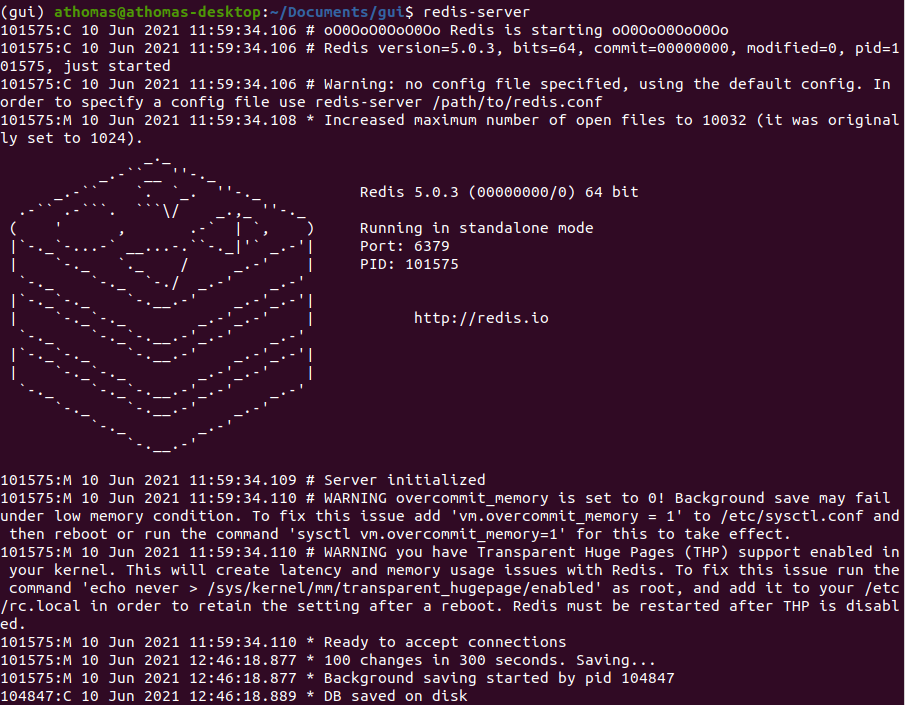
<figcaption>
<em>the redis-server in a terminal window</em>
</figcaption>
</figure>

 

3.  In second window use command: `rq worker pangia-tasks`.

<figure>
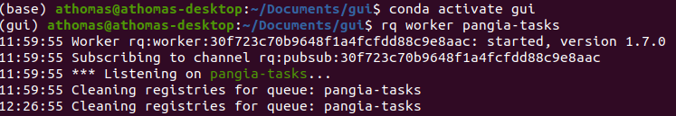
<figcaption>
<em>the worker in a terminal window</em>
</figcaption>
</figure>

 

4.  In third window use commands: `export FLASK_APP=pangia_gui.py` +
    `flask run`.

<figure>
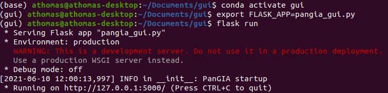
<figcaption>
<em>the flask app in a terminal window</em>
</figcaption>
</figure>

 

5.  In a web browser, navigate to localhost:5000 for GUI access.

#### *Section 4.1.2)*: *Dockerized Case*

1.  In any command line window, navigate to PanGIA GUI directory.

2.  Use command: `docker-compose up`.

3.  In a web browser, navigate to localhost:8000 for GUI access.

### **Section 4.2)**: **GUI Navigation**

#### *Section 4.2.1)*: *Dashboard*

After logging in, users are directed to this page. It lists the history
of both the most recent PanGIA runs and ongoing runs. Links to results
and/or the ongoing job status page is provided under each listing. At
the very bottom of the page, users may click a link directing to the
PanGIA section of the GUI, described in more detail below.

<figure>
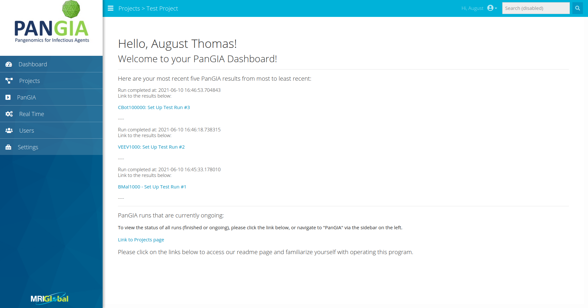
<figcaption>
<em>the dashboard</em>
</figcaption>
</figure>

### **Section 4.2.2)**: **Users**

Interface for adding users to the GUI’s persisted database. Current
users are listed with name, username, email, date of last login, and
role (Admin, User, etc.).

<figure>
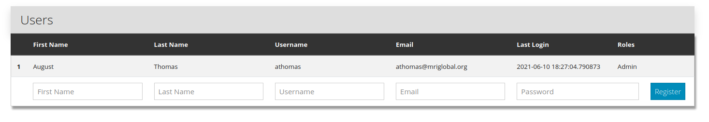
<figcaption>
<em>the users page</em>
</figcaption>
</figure>

### **Section 4.2.3)**: **Settings**

Multi-tabbed interface for specification of general settings, PanGIA
preprocessing/run parameters, project categories, file templates, and
meta-types. Specifics for each tab and sub-tab are listed below.

##### *Section 4.2.3.1)*: General Settings

These settings are dedicated to tailoring PanGIA runs to the user’s
default needs. Most general settings may be adjusted on-the-fly, while
preparing any PanGIA run. However, preparing defaults here will save
time. The general settings are subdivided into three categories:

1.  Application Settings: User specifies PanGIA directory path and
    PanGIA database/uploads path. On Docker, the pathway must reference
    the PanGIA directory mounted to the ‘app’ container. Important: this
    relative path should match the updated line in the
    docker-compose.yml file, as described in [**Section
    3.2**](#section-32-preparing-a-dockerized-environment) above. Users
    may adjust thread-count made available for PanGIA. An even number is
    recommended. Default is two threads.

<figure>

<figcaption>
<em>application settings - within general settings</em>
</figcaption>
</figure>

2.  Preprocessing: Options to alter/filter reads prior to PanGIA
    analysis. May trim reads for quality level, adjust the average
    quality, minimum read length, and “N” base cutoff values, apply a
    low complexity filter, exclude PolyA tails, or indicate a custom
    number of base pairs to cut from 5’ or 3’ ends of reads. The user
    may opt to skip preprocessing.

<figure>
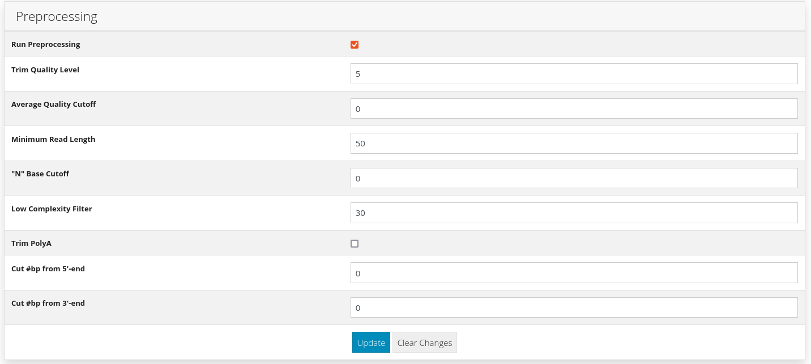
<figcaption>
<em>preprocessing settings - within general settings</em>
</figcaption>
</figure>

3.  Run Parameters: Options determining read scoring, and additional
    forms of analysis (TMARK, Decision Tree, etc.) May specify values
    for seed length, and assign minimal values for score, aligned score,
    read count, read RSNB, linear length, percent genome coverage, and
    depth/RS depth. Scoring method may be selected from a drop-down menu
    (Standalone/Background/Combined), and a series of check boxes
    determine if additional analyses are included in the run.

<figure>
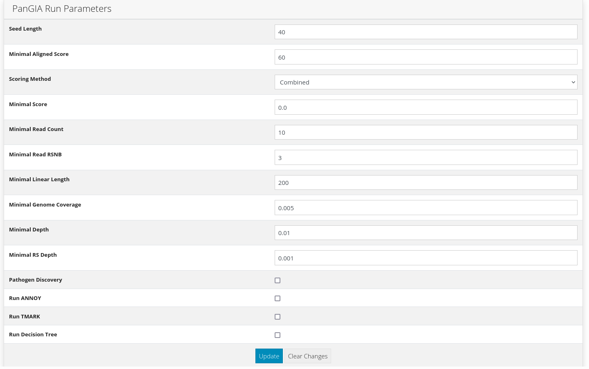
<figcaption>
<em>run parameter settings - within general settings</em>
</figcaption>
</figure>

##### *Section 4.2.3.2)*: *Project Settings*

Used to consolidate and organize related PanGIA uploads/runs. Existing
Projects may be archived or deleted. Projects are instantiated with a
name, description, and slug. They may be constructed as children of an
existing parent Project. When providing a name and slug, use only
alphanumeric and ‘\_’ characters.

<figure>
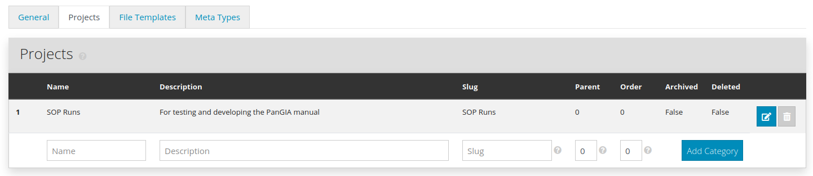
<figcaption>
<em>project settings</em>
</figcaption>
</figure>

##### *Section 4.2.3.3)*: *File Template Settings*

User may specify PanGIA input file types other than .fastq on this tab.
File Templates require a name, description, and file extension. When
creating a new File Template, the user must decide which Meta-Types will
be available for runs using that File Template. A default for .fastq
files is included.

<figure>
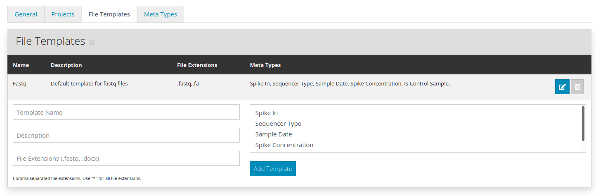
<figcaption>
<em>file template settings</em>
</figcaption>
</figure>

##### *Section 4.2.3.4)*: *Meta-Type Settings*

User may impose additional rules regarding meta-data, grouping it
together and limiting input variance. Default Meta-Types include names
of spiked-in organisms and spike-concentration, sequencing protocol, and
the sampling date. User may specify whether data was a control sample.
New Meta-Types require a name, description, and value (string, integer,
Boolean, date, etc.), and may be designated as ‘required’ if desired.

<figure>
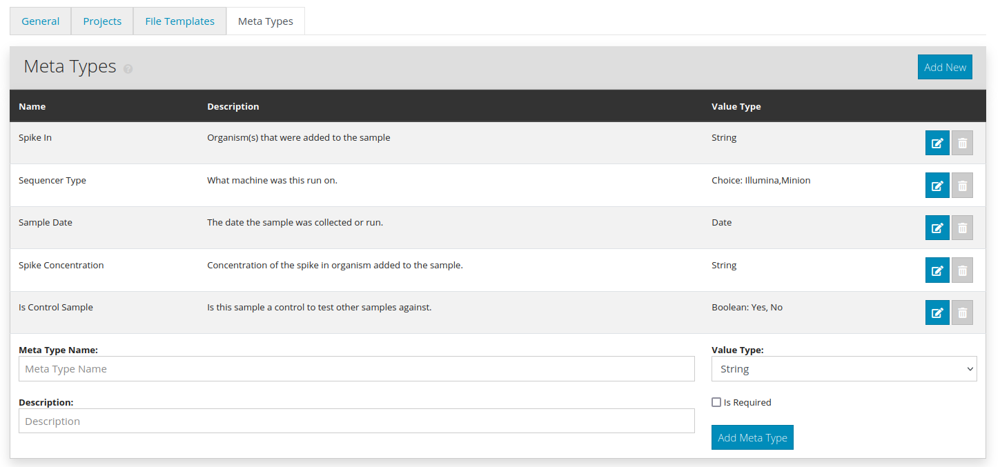
<figcaption>
<em>meta-type settings</em>
</figcaption>
</figure>

#### **Section 4.2.4)**: **Projects**

Provides the name of each Project constructed in the Settings - Projects
tab as described above in [**Section
4.2.3.2**](#section-4232-project-settings). Clicking on the name of a
Project yields a list of all the files that have been uploaded to that
Project. The list is grouped by File Template. Files may be ordered by
ascending/descending or date/name. Each File Template header has a large
blue button labeled ‘Add New File’ - this directs the user to the upload
interface. Files uploaded through the GUI are copied into a new
directory named after the Project in the local pangia/upload directory.

<figure>

<figcaption>
<em>file list within a project</em>
</figcaption>
</figure>

 

<figure>
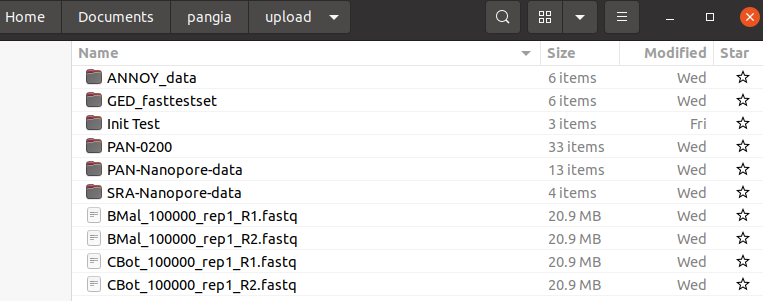
<figcaption>
<em>file browser - default upload path corresponds to general settings
specification</em>
</figcaption>
</figure>

##### *Section 4.2.4.1)*: *Running PanGIA from the Projects Tab*

To start a job from the Project menu, use the ‘Run PanGIA’ button on any
file uploaded to the Project. Each run requires a name and description.
Drop-down menus specify which paired files are to be used. The first
menu option defaults to whatever file the Run Information page was
accessed from. All General settings may be adjusted here: the interface
is identical to that appearing in [**Section
4.2.3.1**](#section-4231-general-settings).

##### *Section 4.2.4.2)*: Exploring the Projects Tab

Files listed within a Project have three interactive links. The View
Meta Data and View Results links direct the user to a new page, with two
tabs. These tabs are named X Information, where ‘X’ is the File
Template, and Results.

1.  The X Information tab specifies the filename, upload date, filepath,
    and description.

<figure>
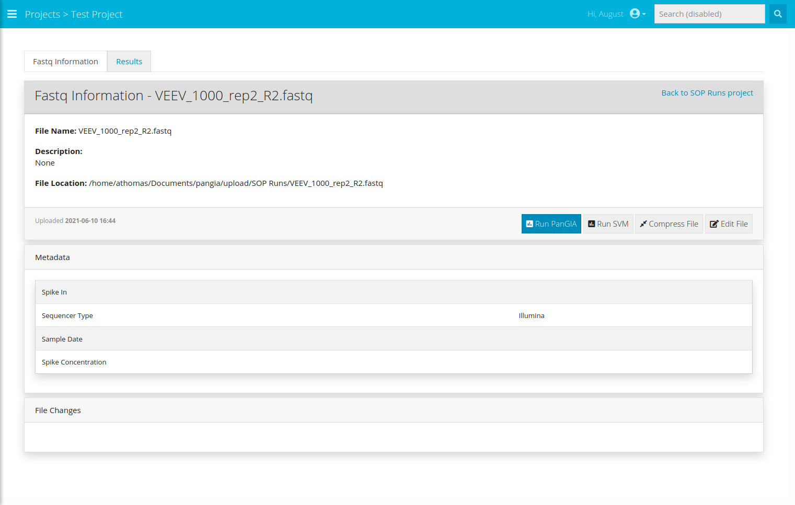
<figcaption>
<em>the “X” info information tab</em>
</figcaption>
</figure>

2.  The Results tab lists all PanGIA runs that the file has been part
    of. Details include run name/date, description, parent Project,
    user, and filenames.

<figure>
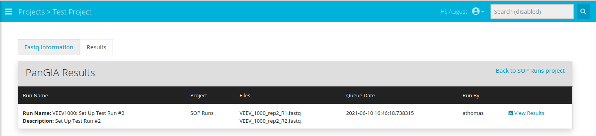
<figcaption>
<em>the results tab within a project</em>
</figcaption>
</figure>

3.  Runs have a link labeled ‘View Results’. Following this link directs
    the user to the PanGIA Results section of the GUI, described below
    in [**Section 4.2.5**](#section-425-pangia-pangia-results).

#### **Section 4.2.5)**: **PanGIA & PanGIA Results**

Lists all queued and completed jobs, regardless of Project. Each
completed job contains the same information found in the Results tab
accessible through the Projects section of the GUI; each job also has
the same ‘View Results’ link. Both are described above in [**Section
4.2.4**](#section-424-projects).

<figure>
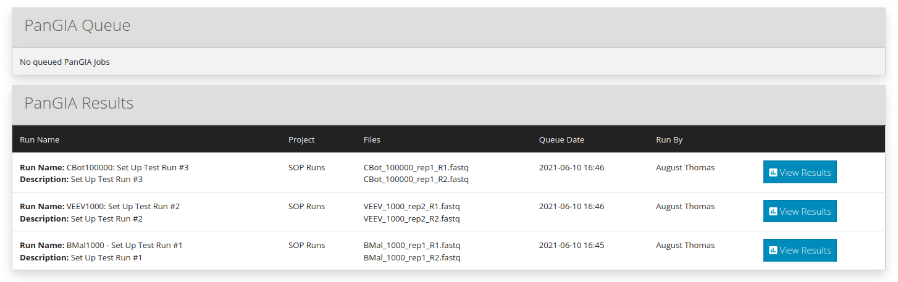
<figcaption>
<em>the PanGIA runs page accessed via the GUI sidebar</em>
</figcaption>
</figure>

##### *Section 4.2.5.1)*: *Results Page*

The Results page provides run name and description, and features an
interactive window to browse rows of the .tsv file output of the PanGIA
run. This page also links to the Visualizer, which will graphically
display that output. An in-depth PanGIA run log is provided at the
bottom – the printout there is similar to what can be found in in the
worker printout during the run. An example Results page appears below.

<figure>
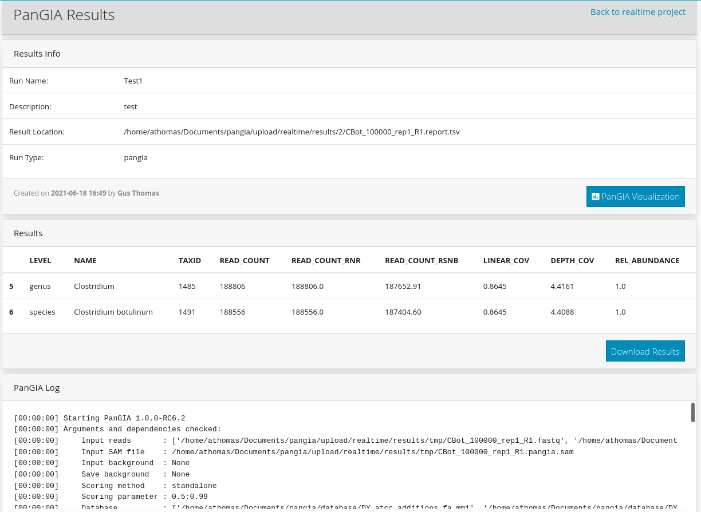
<figcaption>
<em>the results page of a PanGIA run</em>
</figcaption>
</figure>

#### **Section 4.2.6)**: **PanGIA Real-Time**

User specifies a job name, description, and associated Project, as
usual. Instead of paired files, the user must provide the path to a
directory that Real-Time PanGIA is listening for. This directory should
be the dumping point for ongoing nanopore sequencing. Notably, once
Real-Time PanGIA is initiated, the user must manually terminate the job
as desired. Completed Real-Time jobs persist PanGIA results from the
last job iteration.

<figure>
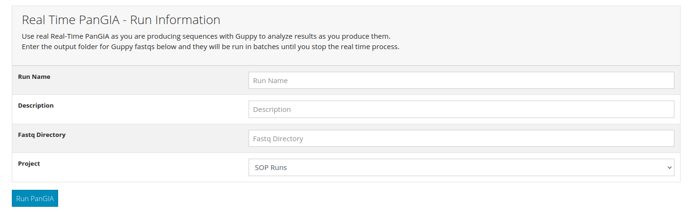
<figcaption>
<em>setting up a RealTime PanGIA run</em>
</figcaption>
</figure>

### **Section 4.3)**: **Examples of Usage**

#### **Section 4.3.1)**: **Baseline Example**

The following walkthrough describes a typical PanGIA run with default
settings. For this example, assume the Project `SOP_Runs` has already
been established, and is accessible through the GUI sidebar as shown
below.

<figure>
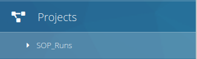
<figcaption>
<em>project sidebar dropdown menu - leads to project file list</em>
</figcaption>
</figure>

 

This link redirects to the file page associated with ‘SOP\_Runs’. For
the purposes of this tutorial, assume that two .fastq files – named
`BMal_100000_rep1_R1` and `BMal_100000_rep1_R2` – have already been
uploaded to the Project.

Clicking on the Run PanGIA buttons associated with either .fastq file
directs to the Run PanGIA page. As discussed in [**Section
4.2.4.1**](#section-4241-general-settings), this page is split into Run
Information and General settings. Pressing the button associated with
`BMal_100000_rep1_R1` directs to the Run Information page shown below.

<figure>
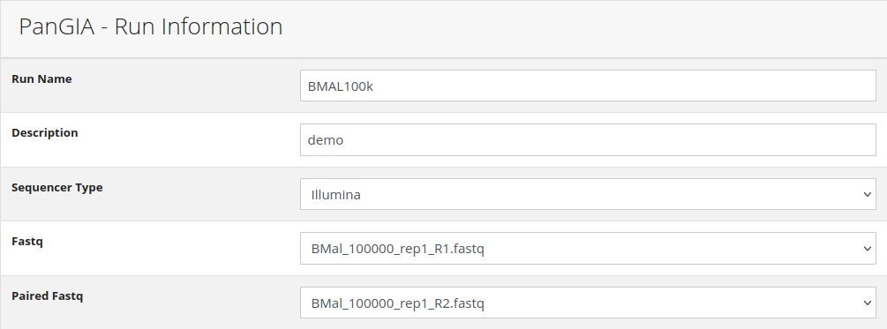
<figcaption>
<em>selecting paired fastq files</em>
</figcaption>
</figure>

 

This run has been given a name and description, and a selection for the
`Paired Fastq` has been made – in this case, `BMal_100000_rep1_R2`. None
of the General settings on the Run PanGIA page need to be adjusted, as
this is a default PanGIA run – so this job is ready to be executed by
clicking on the Run PanGIA button at the bottom of the page!

The PanGIA job is now running, which may be verified in a variety of
ways. First, navigate to the command line terminal running the rq
worker. It should look something like this:

<figure>
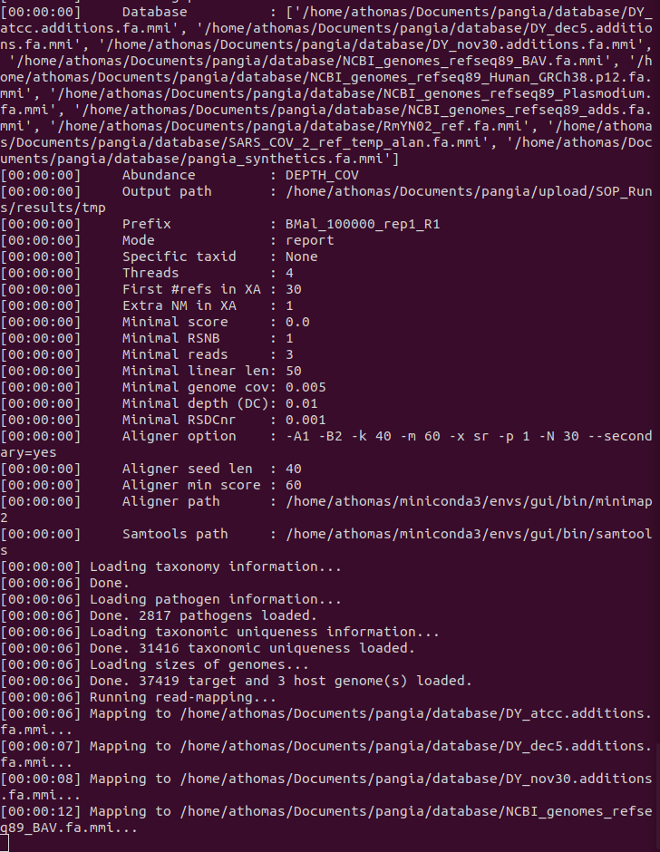
<figcaption>
<em>typical printout in the rq worker terminal during a PanGIA run</em>
</figcaption>
</figure>

 

The rq worker provides time-stamped logs for run status and allows the
user to follow along with each compute stage, or troubleshoot. Heading
back to the GUI, navigate to the Dashboard. It should look something
like this:

<figure>
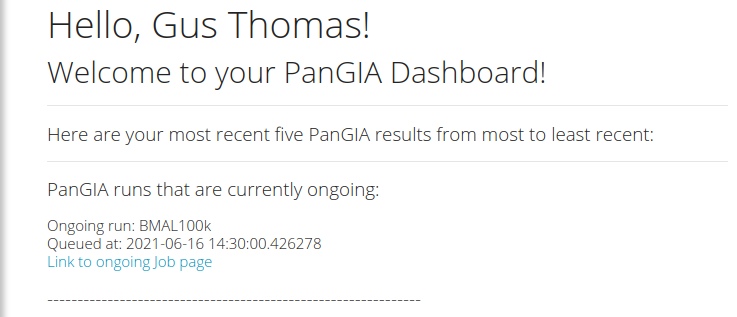
<figcaption>
<em>the dashboard dynamically changes while PanGIA runs are
ongoing/queued</em>
</figcaption>
</figure>

 

The current job `BMAL100k` is listed – and the link below the job
directs to the Running Job page. If additional PanGIA runs were queued
behind `BMAL100k`, they would be listed here. The Running Job page is a
run log, and should look similar to the rq worker printout, as seen
below:

<figure>
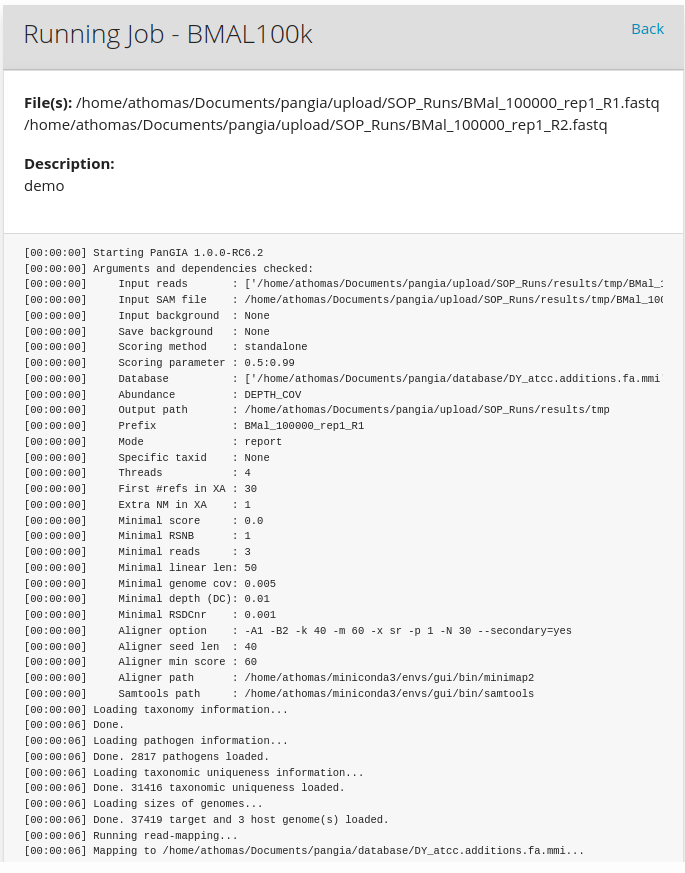
<figcaption>
<em>the job log page - includes similar information to the rq worker
during jobs/queued</em>
</figcaption>
</figure>

 

After the job is finished, the Running Job page turns into a Results
page. Job completion will be reflected in the PanGIA page of the GUI:

<figure>
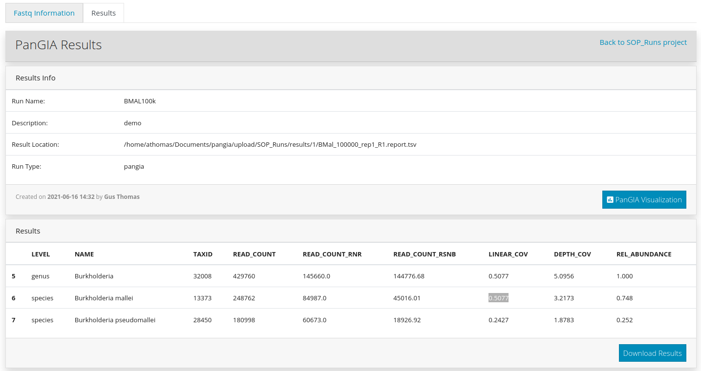
<figcaption>
<em>the jobs page updating following run completion</em>
</figcaption>
</figure>

 

<figure>
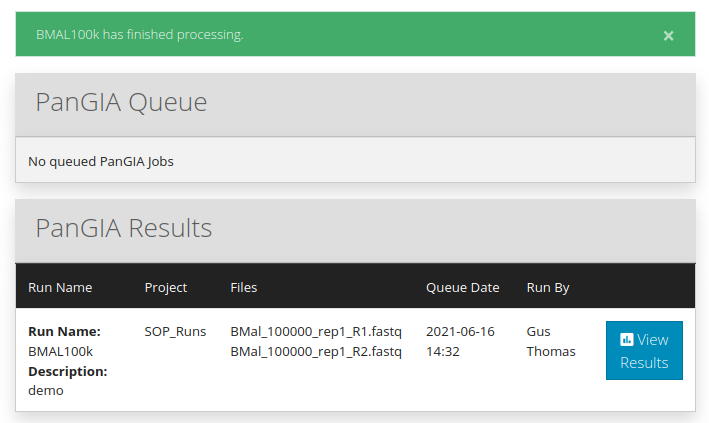
<figcaption>
<em>the jobs page updating following run completion</em>
</figcaption>
</figure>

 

Clicking the PanGIA Visualization button opens the Visualizer in a
separate window. More detail concerning planned features are described
in [**Section 5**](#section-5-planned-visualizer-features), but the
scatterplot for the static PanGIA run as described in this section
should appear similar to the one depicted here:

<figure>
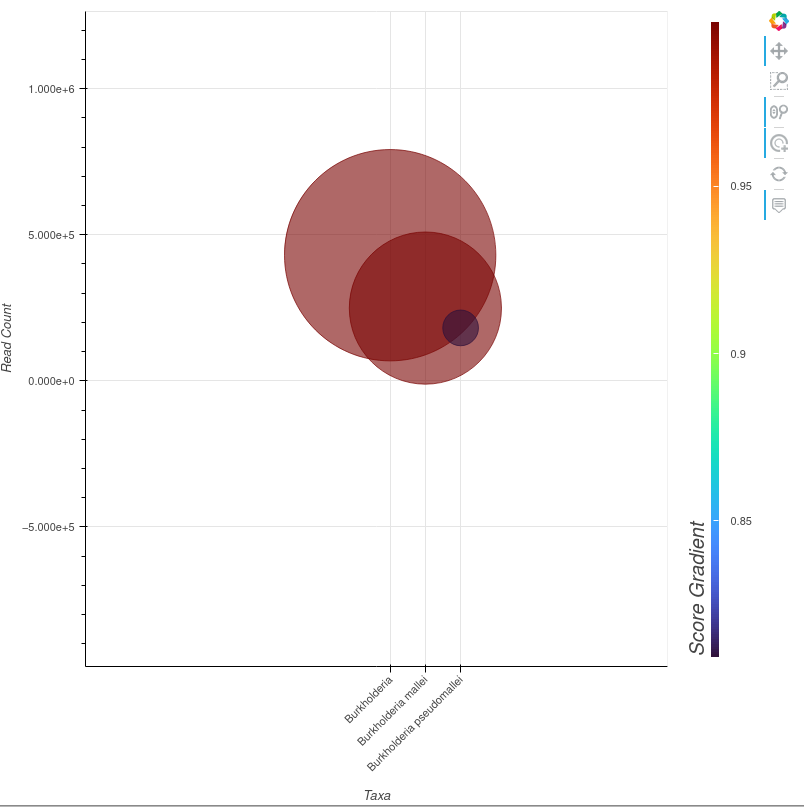
<figcaption>
<em>the visualized results of the run</em>
</figcaption>
</figure>

##### *Section 4.3.1.1)*: *Baseline Example Visualizer Usage and Analysis*

This section discusses current features of the Visualizer and uses the
PanGIA run from [**Section 4.3.1**](#section-431-baseline-example) to
describe how the Visualizer is used to interpret PanGIA results.
Presently, the Visualizer displays hits for taxa between the genus and
strain level, and includes a scatterplot and datatable. On the
scatterplot, each dot on the plot corresponds to one such taxa and are
listed on the x-axis.

1.  The scatterplot y-axis indicates `Raw Read Count` of each hit. This
    axis is dynamically scaled based on maximum/minimum values present
    in the sample. In this example, the y-axis covers a very large range
    of values – between an effective measurement of zero reads and
    one-million. While this would be too large a scale for comparison of
    read count between two strain-level hits, it is a very suitable
    scale in this example, where genus *Burkholderia* is compared
    against species *Burkholderia mallei* and a further strain subset
    *Burkholderia pseudomallei*. In the image above, the center of the
    point representing genus *Burkholderia* intersects the y-axis (read
    count) somewhere between fifty-thousand and five-hundred thousand
    reads – followed in order of magnitude by species and strain.

2.  The scatterplot color-bar `Score-Gradient` axis on the right
    indicates hit performance on the selected `Score` metric – either
    `Standalone`, `Background`, or `Combined`. The color-bar is also
    dynamically scaled; in the above example, strain *Burkholderia
    pseudomallei* scored lowest among the three hits as indicated by its
    purplish hue, placing it near the bottom of the color-bar. However,
    the minimum value for the color-bar is approximately 80%. This
    result suggests that PanGIA’s confidence in correctly identifying
    this strain is somewhat lower than it’s confidence in correctly
    identifying the species or genus that the strain belongs to, but it
    still quite high. Dynamically scaled axes make comparison between
    close-scoring hits easier, given the landscape of hits are
    restricted to a limited range.

3.  The size of each hit on the scatterplot is scaled to its relative
    abundance in the sample. In this example, reads belonging to genus
    *Burkholderia* make up a comparatively much larger share than either
    species or strain.

4.  The associated data table for this PanGIA run contains three
    observations – corresponding to the three data points seen in the
    above scatterplot. A condensed summary of the information in a
    single row of this table appears as a tool-tip when the mouse is
    hovered over the center of a dot in the scatterplot.

<figure>

<figcaption>
<em>the embedded datatable within the visualizer</em>
</figcaption>
</figure>

 

5.  The tool-tip presents numerical results from a given row of the data
    table. In the below image, *Burkholderia pseudomallei* is shown.

<figure>

<figcaption>
<em>the tooltip appears when the mouse is over the center of a
datapoint</em>
</figcaption>
</figure>

## *Section 5)*: **Planned Visualizer Features**

The PanGIA GUI Visualizer is not complete. Two main elements – a
depth-scale-down chart and sample summary pie-charts – are still in
development. In addition, several widgets will be attached to the
scatterplot to make it more interactive, dynamic, and powerful. Planned
widget features include:

1.  Widgets for Numerical Filtering:
    1.  Read Count
    2.  Linear Coverage
    3.  Score
    4.  Depth-of-Coverage
    5.  Rank-Specific Metrics
2.  Widgets for User-Specified Filtering
    1.  Returning only specific genus/species/strain
    2.  Customize y-axis/size-axis/color-axis
3.  Widgets for Categorical Filtering:
    1.  Pathogenic Filtering
    2.  Rank Filtering

An example of the Visualizer as it will appear with widgets:

<figure>
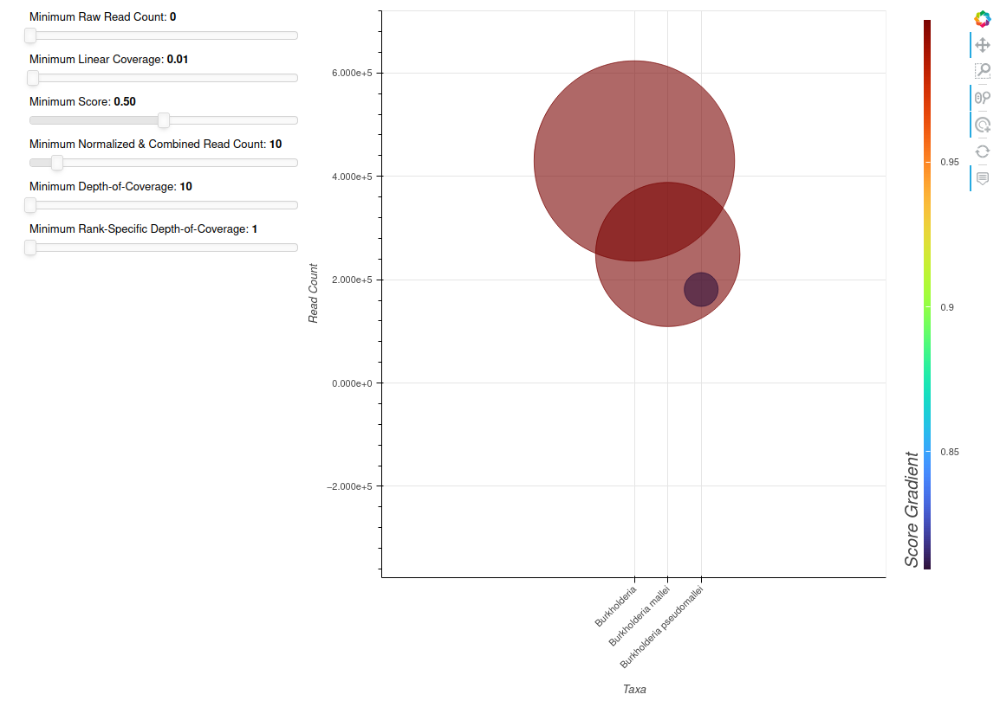
<figcaption>
<em>the final visualizer will include multiple sliders, dynamic axis
toggling, and other filtering tools</em>
</figcaption>
</figure>
